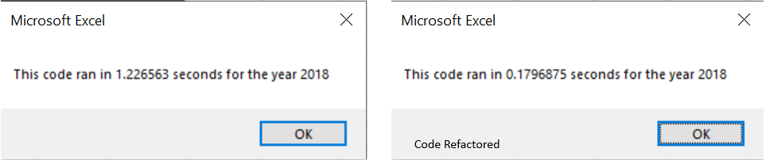

# Wall Street - Stock Analysis 
## Overview of Project

This project is based on mastering Microsoft Excel and most importantly using Macros to automate a tedious approach using formulas and functions on excel. This short but explanatory code helps with understanding the results of the public companies in stock market with the help of just a few clicks of the mouse.
Basic coding concepts implemented on Vba to analyze the overall volumes and returns for each year on 12 environment friendly public companies (2017 and 2018).

### Purpose

To refactor or restructure code to be efficient (Less time consuming and run quicker), so that larger data sets are analyzed in a shorter processing time than initally, and to consider future data analysis once added or retrieved.
This was to satisfy Steve's request for his parents as clients to help them in deciding they all-in investemnt with a particular green company. 

## Analysis 
To attain the purpose of this porject, A run through with the dataset shows green companies identified with their stock ticker symbols and their daily trades (volumes) and returns for the day. So to analyze the company's performace for the year, automating or coding on Vba to output results showing a total volume trades as well as returns for the year on a comparision basis in one worksheet. 

## Results
* Refactoring the code certainly reduced processing time as depicted in the below images showing run times for analysis. 
* The main factor that helped in reducing processing time is, Instead of instructing the computer to process the entire table rows (3013) for each ticker again and again (in a loop)to populate its volumes and returns, the refactored code does the processing for the data set in arrays or lists as the computer interprets them, improves runtime. 
Further The idea of the analysis was to depict the public company's entire years outcome of volume and returns in one sheet also color coding to visually show the companies that had positve returns. 

## Code refactored

```
Dim tickerIndex As Integer
         
    Dim tickerVolumes(12) As Long
    Dim tickerStartingPrices(12) As Single
    Dim tickerEndingPrices(12) As Single
    
    For tickerIndex = 0 To 11
        tickerVolumes(tickerIndex) = 0
        tickerIndex = 0
        
            For i = 2 To RowCount
                tickerVolumes(tickerIndex) = tickerVolumes(tickerIndex) + Cells(i,8).Value
        
                If Cells(i - 1, 1).Value <> tickers(tickerIndex) And Cells(i, 1).Value = tickers(tickerIndex) Then
                    tickerStartingPrices(tickerIndex) = Cells(i, 6).Value
                End If

                If Cells(i + 1, 1).Value <> tickers(tickerIndex) And Cells(i, 1).Value = tickers(tickerIndex) Then
                    tickerEndingPrices(tickerIndex) = Cells(i, 6).Value
                    tickerIndex = tickerIndex + 1
                End If
            Next i
    Next tickerIndex

```

### Image Showing 2017 and 2018 Stock Analysis Outputs


### Image showing Original Processing time to refactored processing time




### Screenshot showing original script and refactored script


## Summary:
##### General
1. Advantages -     (1) An improved processing time. 
                    (2) A chance to clean or create a more readable script 
                    (3) A chance to fix bugs without changing the outcome
                    (4) Keeping it up to date

2. Disadvantages -  (1) It could get expensive to refactor an already working code.
                    (2) A chance to introduce more bugs or errors with existing code.

##### VBA Script
1. Advantages -     (1) A tad bit faster analysis with the processing time, but looking at a bigger picture a refactored code will definately be quicker.
                    (2) Help understand other ways or perspective of coding. (alternatives)

2. Disadvantages -  (1) I feel that it is time consuming trying to restucture an already working code. 
                    (2) As I have experienced with this project, I introduced a couple of errors or spelling mistakes that i needed to revise or runthrough the code again. (Risk of creating errors to a working code) 
                    (3) With my first time glancing through the challenge, the concept seemed a little confusing but later it got clear.

